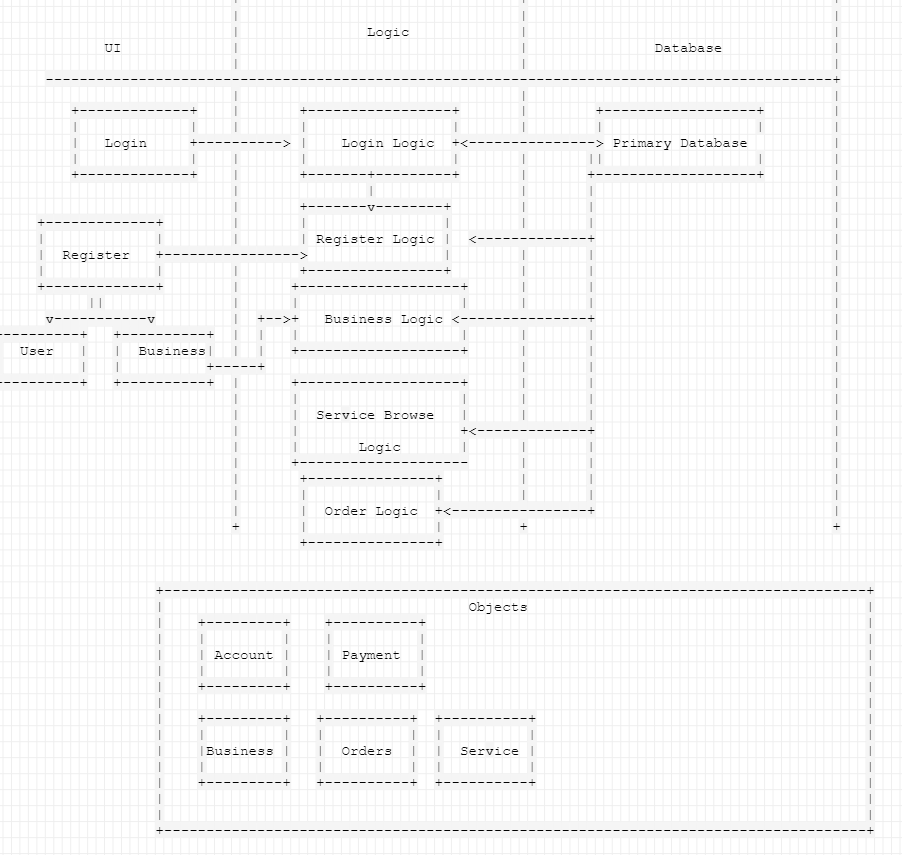

Our architecture is a three tier architecture involving a surface UI layer, logic layer, and a database layer.  We also have a separate package for various structure objects.
For this iteration our primary source file is the database which creates our fake implimentation of all our backround objects as well as the login UI which links to various
logic packages.
