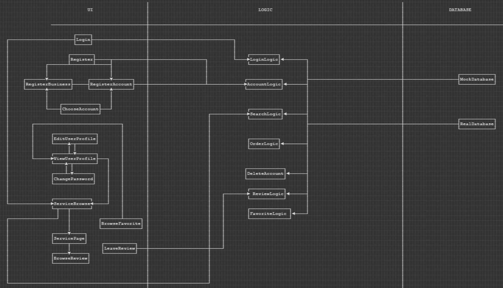
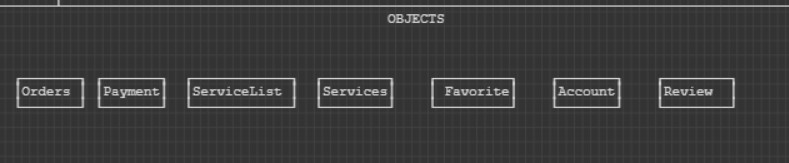

The first image is our interactions between layers. The second image is our 
objects. 

Note: RegisterBusiness does not interact with RegisterAccount. The line between
them is intended to indicate that registerBusiness and registerAccount interacts with AccountLogic.