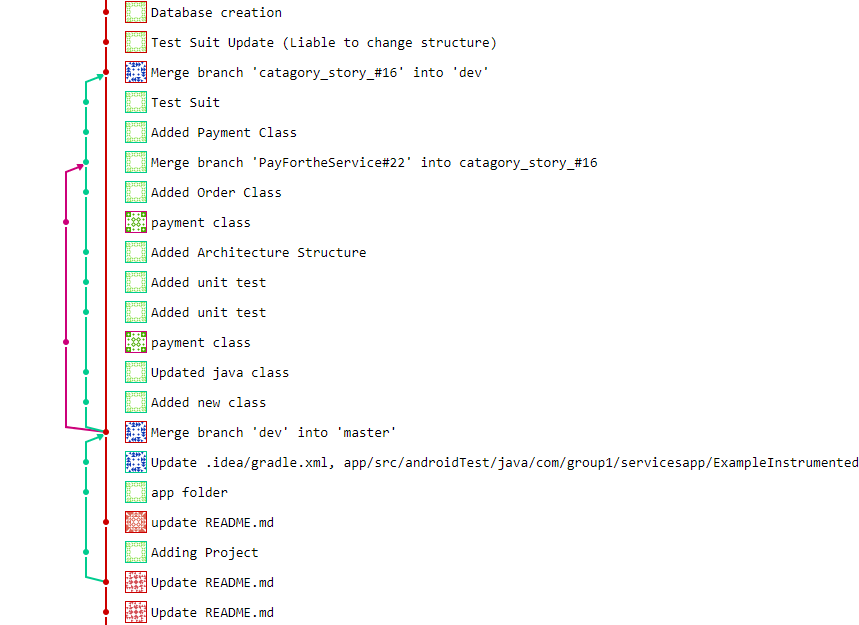

Iteration 1 Worksheet
=====================

Adding a feature
-----------------

Our main feature we completed this iteration was that of searching the database for a provider of a service.
This could be searching for either a specific company or browsing a list of all companies fitting a given catagory.  In order to complete this
objective we first had to consider how we would implement our database of services, which we decided for now to use a simple linked list becuase it provides
easy searching as well as the ability to retrieve all items that match a certain criteria.
The user stories related to this are:

- #42 Search for a service catagory [#42](https://code.cs.umanitoba.ca/3350-winter-2021-a01/group-1/-/issues/42)
- #17 Search for a specific provider [#17](https://code.cs.umanitoba.ca/3350-winter-2021-a01/group-1/-/issues/17)
- #16 Browse a catagory [#16](https://code.cs.umanitoba.ca/3350-winter-2021-a01/group-1/-/issues/16)

Although we didn't have time to implement the UI for this feature we did finish up all logic and database such that given either a name or catagory
it one can easily search the database.  The primary merges used for this feature is listed below however most of our work was done locally and on our individual branches.

[Merge of catagory and service database](https://code.cs.umanitoba.ca/3350-winter-2021-a01/group-1/-/merge_requests/8)

Exceptional code
----------------

[Service test with exception](https://code.cs.umanitoba.ca/3350-winter-2021-a01/group-1/-/blob/d00bc6e64ccbe4d567203205cbb38fc12751fa89/app/src/test/java/com/group1/servicesapp/ServiceUnitTests.java)
When searching for a service it relevant to confirm whether or not a valid string was passed to the search function.  If not we must throw an exception which is shown 
in the test file above.

Branching
----------

We used [Git Branching](https://code.cs.umanitoba.ca/3350-winter-2021-a01/group-1/-/blob/master/docs/Branching%20Strategy.md) model for our iteration.

Git branching was successfully used to add a feature in the `catagory_story_#16` branch as shown below.

SOLID
-----
We investigated group 2

The following is a link to the issue we have created: https://code.cs.umanitoba.ca/3350-winter-2021-a01/group-2/-/issues/27

Within that issue, there will be a link to the Commit containg the SOLID violation. 

Agile Planning
--------------
When starting interation 1, we greatly underestimated the time required to complete a single user story or feature. As a result, we have pushed back a few issues to iteration 2.
We plan to properly evaluate our estimated completion time for the next iteration. (Issues pushed back shown below)

At the very beginning of our planning, we wanted the app to tell the consumer the estimated time arrival based on the business of the providers schedule and distance. 
We decided to postpone the calculation of the distance of the provider and set it to a standard 30 minute arrival from the first time available. This will simplify our 
algorithms for now and we plan on possibly adding that feature back in future iterations. 

The features and user stories we pushed to iteration2 are [Account Creation](https://code.cs.umanitoba.ca/3350-winter-2021-a01/group-1/-/issues/5), [Reviews](https://code.cs.umanitoba.ca/3350-winter-2021-a01/group-1/-/issues/4), [Save a Provider](https://code.cs.umanitoba.ca/3350-winter-2021-a01/group-1/-/issues/3), [Book a Provider](https://code.cs.umanitoba.ca/3350-winter-2021-a01/group-1/-/issues/2), [Edit Profile](https://code.cs.umanitoba.ca/3350-winter-2021-a01/group-1/-/issues/14), and [Order Description](https://code.cs.umanitoba.ca/3350-winter-2021-a01/group-1/-/issues/38).
